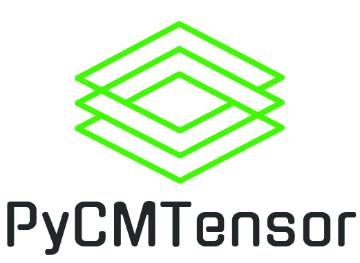

 
 
 
 

A Tensor-based choice modelling estimation package written in Python

# Welcome

PyCMTensor is a tensor-based discrete choice modelling estimation Python library package.
It has a particular focus on estimation of hybrid neural networks and Logit models, as well as on Mixed Logit models. PyCMTensor models are based on computational graphs and models estimated using generalized backpropagation algorithms.
PyCMTensor can be used to fully specify Multinomial Logit and Mixed Logit models, perform model estimation using computational graphs and generate statistical test results for econometric analysis.

## Key features

Main features:

- Interpretable and customizable utility specification syntaxes
- Ability to specifying neural nets with weight and bias parameters inside a utility functions (e.g. TasteNet)
- Perform specification testing, analyze covariances, standard errors for taste parameters.
- Fast execution of model estimation including of simulation based methods, e.g. Mixed Logit models, using computational graph approach
- Model estimating tuning with 1st order (e.g. Adam, Stochastic Gradient Descent) or 1.5th order methods (e.g. Stochastic BFGS)

While other choice modelling estimation software in Python are available, e.g. Biogeme, xlogit, PyLogit, etc., PyCMTensor strives to fully implement deep learning based methods written in a simplified syntax for utility equation specification.

## Documentation

See documentation at https://mwong009.github.io/pycmtensor/